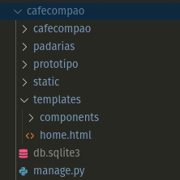
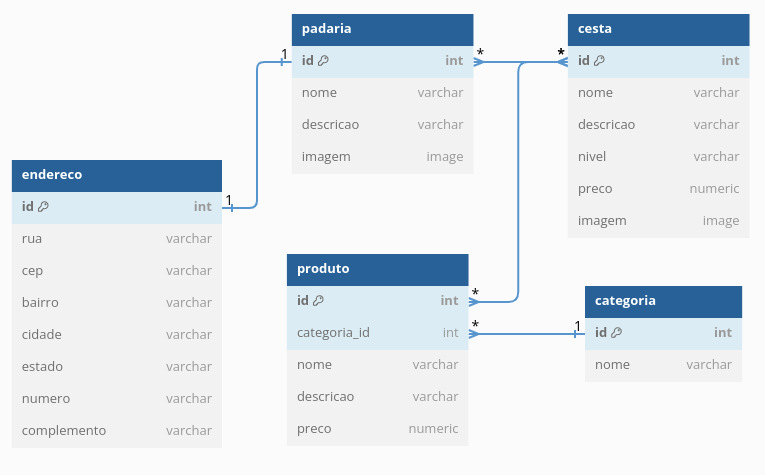
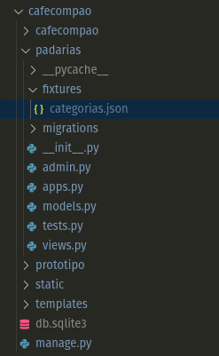
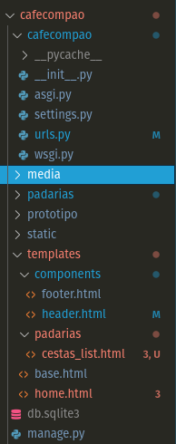
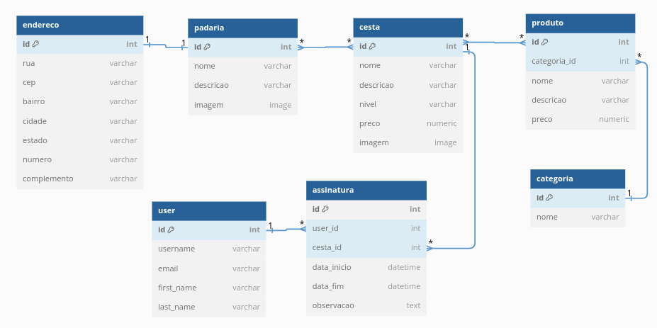
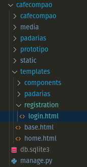
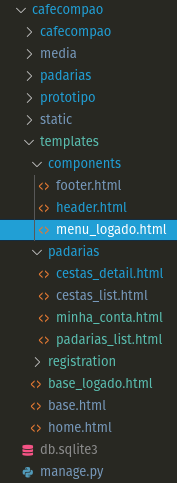
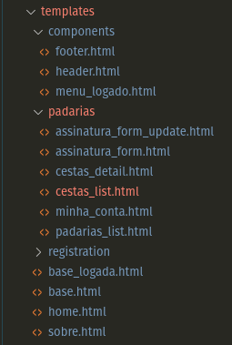
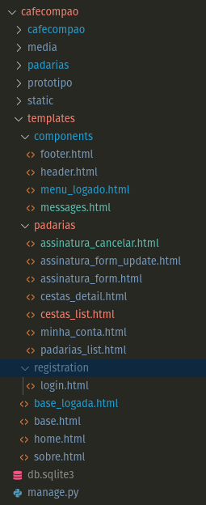

# Programação Web - Atividades Práticas

Prof. Newton Miyoshi - newton.miyoshi@baraodemaua.br


## TLDR

1. [Atividade 1 - Iniciando Projeto Django](#atividade-1---iniciando-projeto-django): Criar um projeto Django chamado `cafecompao` e uma aplicação chamada `padarias`
2. [Atividade 2 - Rotas e Arquivos Estáticos](#atividade-2---rotas-e-arquivos-estáticos): Criar view e rota para a página inicial e configurar arquivos estáticos (CSS, JS, Imagens)
3. [Atividade 3 - Bancos de Dados e ORM](#atividade-3---bancos-de-dados-e-orm): Criar modelo de dados para `Categoria`, criar o migration, carregar as fixtures de categoria e verificar se as categorias foram carregadas corretamente com sqlite browser
4. [Atividade 4 - Bancos de Dados e ORM - Parte 2](#atividade-4---bancos-de-dados-e-orm---parte-2): Incluir dependência para lidar com imagens no Django ( lib 'Pillow' ), criar modelo de dados para `Cesta` e `Produto` e os relacionamentos entre eles, criar e aplicar migrations, criar e aplicar fixtures.
5. [Atividade 5 - Administração de Dados](#atividade-5---administração-de-dados): Registrar os modelos de dados no admin do Django, criar super usuário para acessar o admin, verificar se os dados estão sendo exibidos corretamente no admin e cadastrar novos dados
6. [Atividade 6 - Templates e Componentes](#atividade-6---composição-de-templates-e-componentes): Criar template principal e componentes para cabeçalho e rodapé, compor a página inicial com os componentes criados e a partir do template princinipal
7. [Atividade 7 - Listagem e Detalhe de Dados](#atividade-7---list-e-detail-das-cestas-com-views-baseada-em-classes): Criar view e template para listar as cestas e produtos cadastrados
8. [Atividade 8 - Autenticação e Autorização](#atividade-8---autenticação-e-autorização): Configurar autenticação e configurar area logada e página de login
9. [Atividade 9 - Create e Update](#atividade-9---crud-create-e-update-da-assinatura): Criar formularios de cadastro e alteração de assinatura 
10. [Atividade 10 - Delete](#atividade-10---crud-delete-da-assinatura): Criar a funcionalidade de deletar uma assinatura


## Atividade 1 - Iniciando Projeto Django
Realizado em 11/04/24

1. Criar um projeto Django chamado `cafecompao`
2. Criar aplicação chamada `padarias`

### Resumo dos Conceitos Importantes

Nesta atividade vamos criar de uma aplicação web fullstack. Diversos frameworks fullstack utilizam o padrão [MVC (Model-View-Controller)](https://developer.mozilla.org/en-US/docs/Glossary/MVC) que no caso particular do django utiliza uma variação desse modelo chamado [MVT (Model-View-Template)](https://developer.mozilla.org/en-US/docs/Learn/Server-side/Django/Introduction). 

Todo framework de desenvolvimento web terá uma estrutura de pastas e arquivos que são necessários para o funcionamento do projeto. No caso do Django, temos a pasta do projeto principal que contém as configurações gerais (settings.py). Além disso todo framework também terá ferramentas de linha de comando (cli tools) que facilitam a criação de novos componentes do projeto além de outros utilitários. No caso do django essas ferramentas são o django-admin e o manage.py.

Por fim, outro conceito importante é da modularização e reuso de código. Todo framework agrupará seu código em módulos que podem ser reutilizados em diferentes projetos. No caso do Django, esses módulos são chamados de aplicações e são criados a partir do comando `startapp` do manage.py.

### Projeto Django

- Instalar Python: https://www.python.org/downloads/
- Instalar Django: `pip install django` ou `py -m pip install django`
- Criar projeto Django: `django-admin startproject cafecompao` ou `py -m django startproject cafecompao`

### Aplicação Django

- Entrar na pasta criada do projeto: `cd cafecompao`
- Criar aplicação Django: 
`python manage.py startapp padarias` ou `py manage.py startapp padarias`
- Adicionar aplicação ao projeto em `cafecompao/settings.py`

```python
	INSTALLED_APPS = [
		'django.contrib.admin',
		'django.contrib.auth',
		'django.contrib.contenttypes',
		'django.contrib.sessions',
		'django.contrib.messages',
		'django.contrib.staticfiles',
		'padarias',  # adicionar essa linha
]
``` 

- Verificar se está tudo ok rodando o servidor: `py manage.py runserver` e acessar a página `http://localhost:8000` no navegador


## Atividade 2 - Rotas e Arquivos Estáticos
Realizado em 12/04/24

1. Criar view e rota para a página inicial
2. Criar configuração de arquivos estáticos (CSS, JS, Imagens)
3. Criar página inicial a partir do protótipo do Café com Pão

### Resumo dos Conceitos Importantes
Nesta atividade vamos trabalhar dois conceitos importante *roteamento* e *gerenciamento de arquivos estáticos*. As rotas são responsáveis por mapear as URLs acessadas pelo usuário para o código que irá tratar dessa requisiçao. No django, as views são responsáveis por processar as requisições e retornar uma resposta ao usuário. No caso do Django, as views são funções que recebem um objeto `request` e retornam um objeto `response`.

Arquivos estáticos são arquivos que não se alteram em cada requisição tais como imagens, estilos e scripts. Esses arquivos podem ser servidos diretamente pelo servidor web sem a necessidade de processamento adicional. No Django, os arquivos estáticos são armazenados na pasta `static` e são servidos através de uma rota específica. Além disso, o Django possui uma configuração para servir arquivos de mídia (imagens, vídeos, etc) que são enviados pelos usuários. Em produção, arquivos estáticos e de mídia geralmente são armazenados em CDNs ou serviços de armazenamento em nuvem. [Ver mais sobre estáticos em Django.](https://docs.djangoproject.com/en/5.0/howto/static-files/)

### View e Rota Inicial
- Criar view `home` em `padarias/views.py`

```python
from django.shortcuts import render

def home(request):
    return render(request, 'home.html')
```

- Criar rota para view `home` em `cafecompao/urls.py`

```python
from padarias import views  # adicionar esse import no início

urlpatterns = [
    path('admin/', admin.site.urls),
    path('', views.home, name='home'),   # adicionar essa linha
]
```

- Criar pasta `templates` na raiz do projeto, ou seja, a pasta onde está o arquivo `manage.py`, com uma subpasta `padarias` e outra `components`
- Criar arquivo `home.html` em `templates/` com uma página simples html para teste
- Adicionar configuração de templates em `cafecompao/settings.py`

```python
TEMPLATES = [
    {
        'BACKEND': 'django.template.backends.django.DjangoTemplates',
        'DIRS': [
            BASE_DIR / 'templates',
        ]
        'APP_DIRS': True,
        'OPTIONS': {
            'context_processors': [
                'django.template.context_processors.debug',
                'django.template.context_processors.request',
                'django.contrib.auth.context_processors.auth',
                'django.contrib.messages.context_processors.messages',
            ],
        },
    },
]
```

- Rodar o servidor de desenvolvimento `py manage.py runserver` e acessar a página `http://localhost:8000/` no navegador e verificar se a página `home.html` é exibida corretamente

### Arquivos Estáticos
- Criar pasta `static` na raiz do projeto com subpastas `css`, `js` e `img`
- Copiar arquivos de estilo, scripts e imagens do protótipo do Café com Pão que estão na pasta `prototipo` no repositorio do professor para as pastas `static/css`, `static/js` e `static/img` respectivamente
- Adicionar configuração de arquivos estáticos e de media em `cafecompao/settings.py`

```python
STATIC_URL = 'static/'
STATIC_ROOT = BASE_DIR / 'staticfiles'
STATICFILES_DIRS = [
    BASE_DIR / 'static',
]
MEDIA_URL = '/media/'
MEDIA_ROOT = BASE_DIR / 'media'
```

- Configurar as rotas de arquivos estáticos e de pulmão em `cafecompao/urls.py`

```python   
# adicionar essas duas linhas no inicio do arquivo
# importando as funções necessárias para servir arquivos estáticos e de mídia
from django.conf import settings
from django.conf.urls.static import static

urlpatterns = [
    path('admin/', admin.site.urls),
    path('', views.home),
] 
# adicionar essas duas linhas ao final que definem as rotas 
# de arquivo estaticos e de mídia
urlpatterns += static(settings.STATIC_URL, document_root=settings.STATIC_ROOT) 
urlpatterns += static(settings.MEDIA_URL, document_root=settings.MEDIA_ROOT)
```

- Copiar o conteudo do arquivo do protótipo 'prototipo/index.html' para o arquivo 'templates/home.html' e rodar o servidor de desenvolvimento `py manage.py runserver` e acessar a página `http://localhost:8000/` no navegador e verificar se a página `home.html` é exibida corretamente com os estilos e imagens do protótipo
- Ao final dessa atividade teremos a seguinte estrutura de pastas:




## Atividade 3 - Bancos de Dados e ORM 
Realizado em 25/04/24

1. Criar modelo de dados para `Categoria`
2. Criar o migration
3. Carregar as fixtures de categoria
4. Verificar se as categorias foram carregadas corretamente com sqlite browser

### Resumo dos Conceitos Importantes

Nesta atividade vamos trabalhar com bancos de dados e o ORM (Object Relational Mapping). O ORM é uma técnica de mapeamento de objetos para tabelas de banco de dados relacionais. O ORM permite que o desenvolvedor utilize objetos e métodos para manipular dados no banco de dados sem a necessidade de escrever SQL diretamente. Além de abstrair a comunicação com o banco de dados, o ORM facilita o desenvolvimento de consultas e lida com diversos aspectos como segurança, otimização, migrações e consistência dos dados.

O Django possui um ORM poderoso que permite a criação de modelos de dados, consultas complexas e migrações de banco de dados de forma simples e eficiente. [Ver mais sobre ORM em Django.](https://docs.djangoproject.com/en/5.0/topics/db/models/)

Outros conceitos que vamos ver é o de migrations e fixtures. Migrations são arquivos que contém as alterações no banco de dados e são gerados pelo ORM sempre que existe alguma alteração no modelo de dados. As migrations representam as alterações no banco de dados e portanto são versionadas e podem ser revertidas. Fixtures são arquivos que contém dados iniciais para popular o banco de dados. Fixtures são úteis para popular o banco de dados com dados de teste ou dados iniciais para a aplicação (dados de configuração).

### Modelo de Dados

- Vamos inicialmente o seguinte modelo de dados do Café com Pão na imagem abaixo:
- Vamos implementar inicialmente sem considerar a necessidade do usuário realizar as assinaturas de cestas diretamente no site. Vamos divulgar somente as cestas, produtos e as padarias e caso o cliente deseja, ele pode entrar em contato com qualquer uma das padarias da rede e continuar a assinatura diretamente com a padaria.



### Criar Model de Padaria

- Models são classes que representam as tabelas do banco de dados. Cada atributo da classe representa uma coluna da tabela. O Django possui diversos tipos de campos que representam os tipos de dados do banco de dados. [Ver mais sobre modelos de dados em Django.](https://docs.djangoproject.com/en/5.0/topics/db/models/#fields)
- Criar modelo de dados para `Categoria` em `padarias/models.py`

```python
class Categoria(models.Model):
    nome = models.CharField(
        verbose_name="Nome", max_length=100, unique=True, null=False, blank=False, help_text="Nome da categoria")

    def __str__(self):
        return self.nome
``` 

### Criar Migration

- Criar migration automaticamente para o modelo de dados `Categoria` com o comando `py manage.py makemigrations`
- Verificar que o arquivo de migration foi criado em `padarias/migrations`

```python
from django.db import migrations, models
 
class Migration(migrations.Migration):
 
    initial = True
 
    dependencies = [
    ]
 
    operations = [
        migrations.CreateModel(
            name='Categoria',
            fields=[
                ('id', models.BigAutoField(auto_created=True, primary_key=True, serialize=False, verbose_name='ID')),
                ('nome', models.CharField(help_text='Nome da categoria', max_length=100, unique=True, verbose_name='Nome')),
            ],
        ),
    ]
```

- Aplicar a migration com o comando `py manage.py migrate`
- Saída esperada:

```bash
python manage.py migrate       
Operations to perform:
  Apply all migrations: admin, auth, contenttypes, padarias, sessions
Running migrations:
  Applying contenttypes.0001_initial... OK
  Applying auth.0001_initial... OK
  Applying admin.0001_initial... OK
  Applying admin.0002_logentry_remove_auto_add... OK
  Applying admin.0003_logentry_add_action_flag_choices... OK
  Applying contenttypes.0002_remove_content_type_name... OK
  Applying auth.0002_alter_permission_name_max_length... OK
  Applying auth.0003_alter_user_email_max_length... OK
  Applying auth.0004_alter_user_username_opts... OK
  Applying auth.0005_alter_user_last_login_null... OK
  Applying auth.0006_require_contenttypes_0002... OK
  Applying auth.0007_alter_validators_add_error_messages... OK
  Applying auth.0008_alter_user_username_max_length... OK
  Applying auth.0009_alter_user_last_name_max_length... OK
  Applying auth.0010_alter_group_name_max_length... OK
  Applying auth.0011_update_proxy_permissions... OK
  Applying auth.0012_alter_user_first_name_max_length... OK
  Applying padarias.0001_initial... OK
  Applying sessions.0001_initial... OK
```

### Criar e carregar Fixtures

- Criar arquivo `categorias.json` na pasta `padarias/fixtures` com os dados de categorias
- Fixtures no django possuem um formato específico que é um array de objetos json onde cada objeto representa um registro da tabela. [Ver mais sobre fixtures em Django.](https://docs.djangoproject.com/en/5.0/howto/initial-data/)

```json
[
    {
        "model": "padarias.categoria",
        "pk": 1,
        "fields": {
            "nome": "Frutas"
        }
    },
    {
        "model": "padarias.categoria",
        "pk": 2,
        "fields": {
            "nome": "Bebidas"
        }
    },
    {
        "model": "padarias.categoria",
        "pk": 3,
        "fields": {
            "nome": "Pães"
        }
    },
    {
        "model": "padarias.categoria",
        "pk": 4,
        "fields": {
            "nome": "Salgados"
        }
    },
    {
        "model": "padarias.categoria",
        "pk": 5,
        "fields": {
            "nome": "Biscoitos"
        }
    }
]
```

- Carregar as fixtures com o comando `py manage.py loaddata categorias`

### Verificar Dados no Banco de Dados

- Verificar se as categorias foram carregadas corretamente com o sqlite browser
- Instalar o sqlite browser: https://sqlitebrowser.org/dl/
- Abrir o arquivo `db.sqlite3` que esta na raiz do projeto com o sqlite browser e verificar se as categorias foram carregadas corretamente
- Existe uma extensão no VS Code chamada `SQLite` que também pode ser utilizada para visualizar o banco de dados
- Ao final dessa atividade teremos a seguinte estrutura de pastas:



### Atividade em Aula
- Reproduzir os passos acima
- Enviar para github com mensagem de commit 'Atividade 3 - Bancos de Dados e ORM parte 1'

## Atividade 4 - Bancos de Dados e ORM - Parte 2 
Realizado em 26/04/24

1. Incluir dependência para lidar com imagens no Django ( lib 'Pillow' )
2. Criar modelo de dados para `Cesta` e `Produto` e os relacionamentos entre eles
3. Criar e aplicar migrations
4. Criar e aplicar fixtures.

### Resumo dos Conceitos Importantes
Nesta atividade vamos trabalhar alguns conceitos importantes relacionado a ORM: como representar relacionamento entre tabelas e como representar os diferentes tipos de dados. Em SGBDs relacionais temos 3 tipos de relacionamentos: 1 para 1, 1 para N e N para N. No Django, os relacionamentos entre modelos são representados por campos especiais que representam a relação entre as tabelas. Os tipos de relacionamentos mais comuns são: `ForeignKey`, `ManyToManyField` e `OneToOneField`. [Ver mais sobre relacionamentos em Django.](https://docs.djangoproject.com/en/5.0/topics/db/models/)

Os bancos de dados relacionais possuem diversos tipos de dados que representam os diferentes tipos de dados que podem ser armazenados. No Django, os tipos de dados são representados por campos que representam os tipos de dados do banco de dados. Além dos tipos de dados padrão do banco de dados, o Django possui campos especiais para armazenar arquivos, imagens, JSON, etc. [Ver mais sobre tipos de dados em Django.](https://docs.djangoproject.com/en/5.0/ref/models/fields/). Nesta atividade vamos incluir o tipo de campo para represenar imagens no modelo de dados de `Padaria` e `Cesta` que possui a lib de dependencia chamada Pillow.

### Incluir dependência para lidar com imagens no Django
- Instalar Pillow: `pip install Pillow` ou `py -m pip install Pillow`

### Criar Model de Cesta e Produto
- No arquivo `models.py` criar o model de Cesta e Produto segundo o ERD da atividade anterior.
- Olhando o ERD o model de `Produto` deve ter um relacionamento `ManyToMany` com `Cesta` e um relacionamento `ForeignKey` com `Categoria`
- No arquivo `models.py`

```python
import uuid # colocar essa linha no inicio do arquivo

class Produto(models.Model):
    nome = models.CharField(
        verbose_name="Nome", max_length=100, unique=True, null=False, blank=False, help_text="Nome do produto")
    descricao = models.TextField(
        verbose_name="Descrição", null=True, blank=True, help_text="Descrição do produto")
    preco = models.DecimalField(
        verbose_name="Preço", max_digits=10, decimal_places=2, null=False, blank=False, help_text="Preço do produto")
    categoria = models.ForeignKey(
        Categoria, on_delete=models.SET_NULL, verbose_name="Categoria", null=True, help_text="Categoria do produto")

    def __str__(self):
        return self.nome


class Cesta(models.Model):

    class Niveis(models.TextChoices):
        BASICO = 'B', 'Básico'
        MEDIO = 'M', 'Médio'
        PREMIUM = 'P', 'Premium'

    id = models.UUIDField(primary_key=True, default=uuid.uuid4, editable=False)
    nome = models.CharField(
        verbose_name="Nome", max_length=100, unique=True, null=False, blank=False, help_text="Nome da cesta")
    descricao = models.TextField(
        verbose_name="Descrição", null=True, blank=True, help_text="Descrição da cesta")
    preco = models.DecimalField(
        verbose_name="Preço", max_digits=10, decimal_places=2, null=False, blank=False, help_text="Preço da cesta")
    produtos = models.ManyToManyField(
        Produto, verbose_name="Produtos", help_text="Produtos da cesta", related_name="cestas")
    nivel = models.CharField(
        verbose_name="Nível", max_length=1, choices=Niveis.choices, default=Niveis.BASICO, help_text="Nível da cesta")
    imagem = models.ImageField(
        verbose_name="Imagem", upload_to="cestas", null=True, blank=True, help_text="Imagem da cesta")

    def __str__(self):
        return self.nome
```

#### Observações 

- Verifique que os relacionamentos foram criados com os campos ManyToManyField referenciando a tabela de produtos e ForeignKey referenciando a tabela de categorias.
- No caso de Cesta, gostariamos de criar os Níveis de cestas. Esse tipo de padrão é comum, sempre que queremos definir tipos de dados que são fixos e não devem ser alterados. Em diversos frameworks esse tipo de padrão é chamado de `Enum`. 
- O método `__str__` é um método especial que retorna uma representação em string do objeto. Funciona como o toString do Java.
- O campo `id` é criado automaticamente como um inteiro autoincremental. No caso do model Cesta, o `id` foi criado como um campo UUIDField que é um campo que gera um identificador único universal. Esse campo é útil para garantir que o identificador seja único em diferentes bases de dados. Existem diversas vantagens e desvantagens para representar o `id` de diferentes formas. [Ver mais sobre UUID em Django.](https://docs.djangoproject.com/en/5.0/ref/models/fields/#uuidfield). 

### Criar e Aplicar Migrations

- Criar migration automaticamente para os modelos de dados `Cesta` e `Produto` com o comando `py manage.py makemigrations`
- Verificar que novos arquivos de migration foram criados em `padarias/migrations`
- Aplicar a migration com o comando `py manage.py migrate`

```bash
❯ python manage.py makemigrations
Migrations for 'padarias':
  padarias/migrations/0002_produto_cesta.py
    - Create model Produto
    - Create model Cesta

❯ python manage.py migrate
Operations to perform:
  Apply all migrations: admin, auth, contenttypes, padarias, sessions
Running migrations:
  Applying padarias.0002_produto_cesta... OK
```

### Criar e Carregar Fixtures
- Copiar os arquivos `produtos.json` e `cestas.json` da pasta `prototipo/fixtures` para a pasta `padarias/fixtures` que contem os dados iniciais de produtos e cestas
- Veja que nos arquivos de fixtures os produtos e cestas estão relacionados com as categorias que foram criadas anteriormente e entre si também. Dessa forma é possível pré-definir esses relacionamentos por meio das fixtures.
- Carregar as fixtures com o comando `py manage.py loaddata produtos` e `py manage.py loaddata cestas` nesta ordem
- Verificar se os produtos e cestas foram carregadas corretamente com o sqlite browser ou via extensao do VS Code

```bash
❯ python manage.py loaddata produtos
Installed 24 object(s) from 1 fixture(s)
❯ python manage.py loaddata cestas
Installed 3 object(s) from 1 fixture(s)
```

### Atividade na Aula
- Reproduzir os passos acima
- Implementar os models restantes (Padaria e Endereço) e os relacionamentos entre eles assim como as migrations e fixtures correspondentes
- Enviar para o github com mensagem de commit 'Atividade 4 - Banco de dados e ORM parte 2'


## Atividade 5 - Administração de Dados
A realizar em 29/04/24

1. Registrar os modelos de dados no admin do Django
2. Criar super usuário para acessar o admin
3. Verificar se os dados estão sendo exibidos corretamente no admin e cadastrar novos dados

### Resumo dos Conceitos Importantes

Nesta atividade vamos trabalhar com a criação de um ambiente para administração de dados, também conhecido como ferramenta de backoffice ou CMS (Content Management System). Esse tipo de ferramenta é geralmente utilizada por administradores de sistemas para gerenciar os dados da aplicação e por usuários internos e equipes responsáveis pelo gerenciamento do negócio. Diversos frameworks possuem ferramentas de administração de dados que permitem a criação, leitura, atualização e deleção de dados diretamente no banco de dados. O Django possui um sistema de autenticação pré-definido assim como um sistema de administração próprio que pode ser facilmente customizado. O painel de administração é uma ferramenta poderosa que permite a administração de dados sem a necessidade de escrever código adicional. O painel de administração é uma ferramenta útil para administradores de sistemas e para a manutenção de dados. [Ver mais sobre administração de dados em Django.](https://docs.djangoproject.com/en/5.0/ref/contrib/admin/)
Neste link é possível ver uma série de temas alternativos, libs utilitárias, tutoriais e videos sobre o admin do Django: [https://github.com/originalankur/awesome-django-admin](https://github.com/originalankur/awesome-django-admin)

### Registrar Modelos no Admin

- Registrar os Models criados no admin do Django alterando o arquivo já existente `padarias/admin.py`

```python

from django.contrib import admin
from .models import Categoria, Produto, Cesta, Padaria

admin.site.register(Categoria)
admin.site.register(Produto)
admin.site.register(Cesta)
admin.site.register(Padaria)
```

### Criar Super Usuário

- Criar um super usuário para acessar o admin com o comando `py manage.py createsuperuser`

```bash
❯ python manage.py createsuperuser
Username (leave blank to use 'newton'): admin
Email address: admin@admin.com
Password: admin123
Password (again): admin123
Superuser created successfully.
```

### Acessar o Admin e Verificar Dados

- Rodar o servidor de desenvolvimento `py manage.py runserver` e acessar o admin `http://localhost:8000/admin`
- Fazer login com o super usuário criado no passo anterior

### Atividade na Aula

- Reproduzir os passos acima 
- Navegar no admin, cadastrar novos dados
- Subir para o github com mensagem de commit 'Atividade 5 - Administração de Dados'

## Atividade 6 - Composição de Templates e Componentes
A realizar em 02/04/24

1. Criar template principal e componentes para cabeçalho e rodapé
2. Compor a página inicial com os componentes criados e a partir do template princnipal

### Resumo dos Conceitos Importantes

Existem diferentes libs e frameworks que permitem a composição de templates e componentes. Essas libs permitem que os desenvolvedores criem templates reutilizáveis e componentes que podem ser utilizados em diferentes partes da aplicação. Um componente é um bloco de código que pode ser reutilizado em diferentes partes da aplicação. Um componente pode ser um cabeçalho, um rodapé, um menu, um formulário, etc. A composição de templates e componentes é uma técnica poderosa que permite a reutilização de código e a criação de interfaces consistentes. 
Frameworks de desenvolvimento web em geral implementam sistemas de templating que usam de duas abordagens principais para construção das páginas web: composição (por meio da inclusão de componentes) e herança (por meio da extensão desses componentes ou templates). 
Os sistemas de template e componentização variam muito em termos de complexidade indo desde de formas simples como componentes web nativos, passando por sistemas de template que criam componentes de baixa/média complexidade (como é o caso do Django) até sistemas de componentização com JSX que permitem incorporar diversos comportamentos diretamente no componente (como é o caso do React e Svelte).
No Django, a composição de templates é feita através de tags e filtros que permitem a inclusão de componentes dentro de outros templates. Além disso, o Django possui um sistema de herança de templates que permite a criação de templates base e a extensão desses templates em outros templates. [Ver mais sobre templates em Django.](https://docs.djangoproject.com/en/5.0/topics/templates/)

### Criar Componentes de Cabeçalho e Rodapé

- Criar os arquivos `header.html` e `footer.html` na pasta `templates/components` 
- A partir do arquivo `home.html`, extrair a parte do cabeçalho (menu superior) e do rodapé (footer) para componentes que foram criados na pasta `templates/components`
- Corrigir os links usando a tag `` para que os links funcionem corretamente e o caminho para as imagens com a tag ``

arquivo `header.html`
```html
<header>
  <nav>
    <span class="logo">
      Café com Pão
      <i class="bi bi-cup-hot"></i>
    </span>
    <ul>
      <li><a href="">Principal</a></li>
      <li><a href="">Padarias</a></li>
      <li><a href="">Cestas</a></li>
      <li><a href="">Sobre</a></li>
    </ul>
    <a href="" class="btn btn-primary">Entrar</a>
  </nav>
</header>
 
```

arquivo `footer.html`
```html

<footer>
  <span class="logo">
    <i class="bi bi-cup-hot-fill"></i>
    CAFÉ COM PÃO
  </span>
  <hr>
  <div id="social">
    <a href="https://www.facebook.com/" target="_blank">
      
    </a>
    <a href="https://www.instagram.com/" target="_blank">
      
    </a>
    <a href="https://www.pinterest.com/" target="_blank">
      
    </a>
  </div>
</footer>
```

- A tag `` é utilizada para carregar os arquivos estáticos como imagens, css e js dinamicamente
- A tag `` é utilizada para gerar a URL correta para a rota especificada. No caso do desenvolvimento local a URL será `http://localhost:8000/nome_da_rota` e em produção a URL será algo como `http://www.cafecompao.com/nome_da_rota`
- No desenvolvimento local, os arquivos estáticos são servidos pelo servidor de desenvolvimento. Em produção, os arquivos estáticos são servidos por um servidor de arquivos estáticos como o `whitenoise`, um bucket (S3 ou GCP) ou uma CDN (Content Delivery Network). Neste caso a tag `static` irá gerar a URL correta para o arquivo estático dependendo do ambiente de execução.
- A rota `home` é a rota que foi criada anteriormente para a página inicial, porém estava sem um `name`, adicionar o name no arquivo `cafecompao/urls.py` para que a tag `` funcione corretamente

```python
urlpatterns = [
    path('admin/', admin.site.urls),
    path('', views.home, name='home'),  # adicionado o parametro name='home'
] 
``` 


### Criar Template Base Principal

- Criar o arquivo `base.html` na pasta `templates` com o seguinte conteúdo

```html

<!DOCTYPE html>
<html lang="pt-br">
<head>
  <meta charset="UTF-8">
  <meta name="viewport" content="width=device-width">
  <title>Café com Pão</title>
  <link href="https://cdn.jsdelivr.net/npm/bootstrap@5.3.3/dist/css/bootstrap.min.css" rel="stylesheet" integrity="sha384-QWTKZyjpPEjISv5WaRU9OFeRpok6YctnYmDr5pNlyT2bRjXh0JMhjY6hW+ALEwIH" crossorigin="anonymous">
  <link rel="stylesheet" href="">
  <link rel="stylesheet" href="https://cdn.jsdelivr.net/npm/bootstrap-icons@1.11.3/font/bootstrap-icons.min.css">
  <script src="https://cdn.jsdelivr.net/npm/bootstrap@5.3.3/dist/js/bootstrap.bundle.min.js" integrity="sha384-YvpcrYf0tY3lHB60NNkmXc5s9fDVZLESaAA55NDzOxhy9GkcIdslK1eN7N6jIeHz" crossorigin="anonymous"></script>
  
</head>
<body>
  
  <main>
    
  </main>
  

  
</body>
</html>
```

- No arquivo `base.html` estamos incluindo os 2 componentes criados anteriormente e definindo o bloco de conteúdo `` para que os templates filhos (aqueles que herdam deste template base) possam sobrescrever o conteúdo desses blocos
- O bloco `` e `` são utilizados para que os templates filhos possam adicionar css e javascript específicos deles. Esses blocos são opcionais.

### Compor a Página Inicial

- Alterar o arquivo `home.html` para herdar do template base `base.html` e sobrescrever o bloco de conteúdo
- Ajustar a url para imagens usando a tag ``

```html




  

<div id="hero" style="background-image: url(">
  <hgroup>
    <h1>Assine sua manhã perfeita!</h1>
    <p>
      Comece suas manhãs com sabor e praticidade Assine o Café com Pão!
    </p>
  </hgroup>
</div>

<section class="featured container">
  
  <div>
    <h2>Cestas com produtos perfeitos!</h2>
    <p>
      Nosso compromisso com a qualidade e a conveniência torna cada entrega uma experiência única. Experimente o que temos a oferecer
    </p>
    <ul>
      <li>Variedade Premium</li>
      <li>Personalização Flexível</li>
      <li>Entrega Confiável</li>
    </ul>
  </div>
</section>

<section class="quote">
  <q class="container">
    Adoro receber minha cesta de café da manhã do Café com Pão toda semana! A variedade de itens frescos e a qualidade dos produtos superam minhas expectativas. Começo cada manhã com um sorriso graças a essa delícia. Recomendo a todos que buscam praticidade e sabor na primeira refeição do dia!
    <br>
    <cite>— Maria da Silva, São Paulo</cite>
  </q>
</section>


```

- No arquivo `home.html` estamos sobrescrevendo o bloco de conteúdo `` com o conteúdo específico da página inicial
- O comando `` é utilizado para herdar do template base `base.html`
- Rodar o servidor de desenvolvimento `py manage.py runserver` e acessar a página `http://localhost:8000/` no navegador e verificar se a página `home.html` é exibida corretamente com o cabeçalho e rodapé criados

### Adicionar conteúdo do Banco de Dados

- Queremos incluir a quantidade de padarias, cestas e produtos que temos na base de dados na nossa view, tornando-a dinâmica.
- Para isso vamos alterar nossa view `home` para que ela busque esses dados no banco de dados e passe para o template `home.html` e renderize esses dados na página
- No arquivo `views.py`

```python
# importar os models
from .models import Padaria, Produto, Cesta

def home(request): 
    qtd_padarias = Padaria.objects.count()
    qtd_produtos = Produto.objects.count()
    qtd_cestas = Cesta.objects.count()
    context = {
        'qtd_padarias': qtd_padarias,
        'qtd_produtos': qtd_produtos,
        'qtd_cestas': qtd_cestas,
    }
    return render(request, 'home.html', context)

```

- Agora precisamos alterar o componente `hero` do template `home.html`
- A seguir somente a parte que foi alterada incluindo as variáveis dinâmicas `qtd_padarias`, `qtd_produtos` e `qtd_cestas` passadas por contexto para o template

```html
<div id="hero" style="background-image: url(">
  <hgroup>
    <h1>Assine sua manhã perfeita!</h1>
    <p>
      Comece suas manhãs com sabor e praticidade Assine o Café com Pão!
    </p>
    <p>
      São {{ qtd_padarias }} padarias parceiras, {{ qtd_cestas }} tipos de cestas incríveis com {{ qtd_produtos }} produtos disponíveis para você escolher.
    </p>
  </hgroup>
</div>
```

### Página "Sobre" com Formulário
- Vamos incluir uma nova página "Sobre" que contem o formulário de contato e uma lista das padarias
- Para isso precisamos: altera a view `about` com a lógica, incluir a rota nova em `urls.py`, criar o template `sobre.html` e incluir o link para essa página no `header.html`
- Primeiramente vamos alterar a view `about` em `padarias/views.py`

```python
def about(request):
    qtd_padarias = Padaria.objects.count()
    padarias = Padaria.objects.all()
    msg_enviada = False
    if request.method == 'POST':
        nome = request.POST.get('nome')
        email = request.POST.get('email')
        mensagem = request.POST.get('mensagem')
        print("--Enviando email-------------------------")
        print(f"Nome: {nome}, Email: {email}, Mensagem: {mensagem}")
        print("-----------------------------------------")
        msg_enviada = True 
    context = {
        'qtd_padarias': qtd_padarias,
        'padarias': padarias,
        'msg_enviada': msg_enviada
    }
    return render(request, 'sobre.html', context) 
```

- Criar a rota para a view `about` em `cafecompao/urls.py`

```python
urlpatterns = [
    path('admin/', admin.site.urls),
    path('', views.home, name='home'),
    path('sobre', views.about, name='about'),
] 
```

- Criar a página `sobre.html` em `templates/` baseado no prototipo `prototipo/sobre.html`

```html





<div id="hero" style="background-image: url()">
  <hgroup>
    <h1>Sobre o Café com Pão!</h1>
    <p>Temos {{ qtd_padarias }} padarias na nossa rede!</p>
  </hgroup>
</div>

<section class="social-container">
  <div class="container">
    <h2>Nossa Rede</h2>
    <p>
      
        {{ padaria.nome }} em {{ padaria.endereco.bairro }} / {{ padaria.endereco.cidade }}<br>
      
    </p>
  </div>
</section>

<section class="container contato">
  
    <div class="alert alert-success" role="alert">
      <i class="bi bi-check-circle"></i>
      Sua mensagem foi enviada com sucesso! Aguarde nosso retorno por email.
    </div>
  
    <h2>Fale Conosco!</h2>

    <form action="" method="post">
      
      <div class="mb-3">
        <label for="email" class="form-label">Seu e-mail</label>
        <input type="email" class="form-control" id="email" name="email" required >
      </div>
      <div class="mb-3">
        <label for="nome" class="form-label">Seu nome</label>
        <input type="text" class="form-control" id="nome" name="nome" required>
      </div>
      <div class="mb-3">
        <label for="mensagem" class="form-label">Mensagem:</label>
        <textarea class="form-control" id="mensagem" name="mensagem" rows="6" required></textarea>
      </div>
      <button class="btn btn-primary btn-lg" type="submit">Enviar</button>
    </form>
  
</section>

```

- Alterar o menu principal em `templates/components/header.html` para incluir um link para a página de listagem de cestas

```html
<header>
  <nav>
    <span class="logo">
      Café com Pão
      <i class="bi bi-cup-hot"></i>
    </span>
    <ul>
      <li><a href="">Principal</a></li>
      <li><a href="">Padarias</a></li>
      <li><a href="">Cestas</a></li>
      <li><a href="">Sobre</a></li>
    </ul>
    <a href="" class="btn btn-primary">Entrar</a>
  </nav>
</header>
```

### Atividade na Aula

- Reproduzir os passos acima
- Criar uma nova página chamada `sobre.html` que herda do template base e inclui o cabeçalho e rodapé e um conteúdo simples


## Atividade 7 - List e Detail das Cestas com Views Baseada em Classes
A realizar em 03/05/24

1. Criar views baseadas em classes para listar, detalhar as cestas e produtos
2. Criar templates para listar e detalhar as cestas e produtos
3. Criar rotas para as views de listagem e detalhamento de cestas e produtos
4. Alterar o menu principal para incluir links para as páginas de listagem de cestas

### Resumo dos Conceitos Importantes
Frameworks web fullstack geralmente usam 2 abordagens para escrita da lógica responsável por lidar com as requisições web: por meio de funções ou com orientação a objetos por meio de classes. Alguns dos frameworks leves que utilizam a abordagem de funções são: Flask, FastAPI, ExpressJS. Já os frameworks mais robustos como Ruby on Rails, CakePHP, Spring Boot, entre outros,  utilizam a abordagem de classes. Django permite os dois tipos de abordagens. 
Geralmente a abordagem por funções é mais simples, direta e flexível, porém necessita que o desenvolvedor tenha um bom controle sobre o código e a organização do projeto. Já a abordagem por classes é mais robusta, organizada e escalável, porém necessita que o desenvolvedor tenha um bom conhecimento sobre orientação a objetos e sobre o framework em si.
No Django, as views baseadas em classes são classes que herdam de classes base do Django e possuem métodos que representam as ações que podem ser realizadas em uma requisição. [Ver mais sobre views baseadas em classes em Django.](https://docs.djangoproject.com/en/5.0/topics/class-based-views/)

### Listar Cestas
Para permitir a listagem das cestas vamos: (i) criar view basead em classe `CestaListView`, (ii) criar a rota para a view de listagem de cestas alterando o arquivo `urls.py`, (iii) criar o template `cestas_list.html` e (iv) alterar o menu principal para incluir um link para a página de listagem de cestas.

- Criar a view baseada em classe `CestaList` em `padarias/views.py`

```python
# importar no inicio do arquivo
from django.views import generic

class CestasList(generic.ListView):
    model = Cesta
    template_name = 'padarias/cestas_list.html'
    context_object_name = 'cesta_list'
```

- Criar a rota para a view de listagem de cestas em `cafecompao/urls.py`

```python
# Mostrando somente a parte que foi alterada
# Incluir um novo item em urlpatterns:
urlpatterns = [
    path('admin/', admin.site.urls),
    path('', views.home),
    path('cestas/', views.CestasList.as_view(), name='cestas_list'),  # adicionar essa linha
] 
```

- Criar o template `cestas_list.html` em `templates/padarias` baseado no prototipo `prototipo/cestas.html`

```html



  

<div id="hero" style="background-image: url()">
  <hgroup>
    <h1>Cestas para todos gostos!</h1>
  </hgroup>
</div>

<section class="container card-container">
  
    <a href="" class="card">
      
      <div class="card-detail">
        <h3>{{ cesta.nome }}</h3>
        <p>{{ cesta.descricao }} </p>
        <span class="preco">{{ cesta.preco }}</span>
      </div>
    </a>
  
</section>


```

- Alterar o menu principal em `templates/components/header.html` para incluir um link para a página de listagem de cestas
- Mostrando somente a parte que foi alterada

```html
  <ul>
    <li><a href="">Principal</a></li>
    <li><a href="">Cestas</a></li>
    <li><a href="">Padarias</a></li>
    <li><a href="">Sobre</a></li>
  </ul>
```

- As imagens das cestas não estarão sendo exibidas pois não criamos os arquivos de media. Para isso, copia a pasta `media` que esta na pasta `prototipo` para a raiz do projeto, ou seja, a pasta `media` ficará na mesma pasta que o arquivo `manage.py` e a pasta  `static`.
- A estrutura de pasta será:

]

### Detalhar Cesta

- Para criar a página de detalhe da Cesta vamos: (i) criar view baseada em classe `CestaDetailView`, (ii) criar a rota para a view de detalhamento de cestas alterando o arquivo `urls.py`, (iii) criar o template `cestas_detail.html` e (iv) alterar o template de listagem de cestas para incluir um link para a página de detalhamento de cestas.

- Criar a view baseada em classe `CestasDetail` em `padarias/views.py`

```python
class CestasDetail(generic.DetailView):
    model = Cesta
    template_name = 'padarias/detail_cestas.html'
```

- Criar a rota para a view de detalhamento de cestas em `cafecompao/urls.py`

```python
# Mostrando somente a parte que foi alterada
# Incluir um novo item em urlpatterns:
urlpatterns = [
    path('admin/', admin.site.urls),
    path('', views.home),
    path('cestas/', views.CestasList.as_view(), name='cestas_list'),  
    path('cestas/<uuid:pk>/', views.CestasDetail.as_view(), name='cestas_detail'),  # adicionar essa linha
] 
```

- Criar o template `cestas_detail.html` em `templates/padarias` baseado no prototipo `prototipo/cestas_detail.html`

```html






<section class="hero-detail">
  <div class="container">
    <div class="cesta-detail">
      <h1>{{ cesta.nome }}</h1>
      <p>{{ cesta.descricao }}</p>
      <span class="cesta-preco">{{ cesta.preco }} / mês</span>
    </div>
    
  </div>
</section>

<section class="container cesta-produtos">
  <h2>Veja os produtos dessa cesta</h2>
  <table class="table">
    <thead>
      <tr>
        <th>Produto</th>
        <th>Descrição</th>
      </tr>
    </thead>
    <tbody>
      
      <tr>
        <td>{{ produto.nome }}</td>
        <td>{{ produto.descricao }}</td>
      </tr>
      
    </tbody>
  </table>
  <a href="" class="btn btn-primary btn-lg">Voltar</a>
</section>


```

- Alterar o template `cestas_list.html` para incluir um link para a página de detalhamento de cestas
- Mostrando somente a parte que foi alterada
```html

  <a href="" class="card">
    
    <div class="card-detail">
      <h3>{{ cesta.nome }}</h3>
      <p>{{ cesta.descricao }} </p>
      <span class="preco">{{ cesta.preco }}</span>
    </div>
  </a>

```

### Atividade na Aula
- Reproduzir os passos acima
- Criar a página de Listagem de Padarias
- Caso dê tempo crie a página de Detalhe da Padaria (não é obrigatório pois não possui o protótipo)
- Subir para o github com mensagem de commit 'Atividade 7 - List e Detail'


## Atividade 8 - Autenticação e Autorização 
A realizar em 09/05/24

1. Configurar model de Assinatura
2. Configurar rotas e mecanismo de autenticação
3. Implementar template de login 
4. Configurar área restrita para usuários autenticados

### Resumo dos Conceitos Importantes
- Autenticação é o processo de verificar a identidade de um usuário. A autenticação pode ser feita de diferentes formas tais como: por meio de um login e senha, por meio de um token, por meio de um certificado digital, por meio de um biometria, por meio de um provedor de autenticidade, entre outras formas. A autenticação é um processo fundamental para garantir a segurança dos dados e a privacidade dos usuários. 
- Autorização é o processo de verificar se um usuário tem permissão para acessar um recurso. A autorização é feita de diferentes formas tais como: por meio de um controle de acesso, por meio de um controle de permissões, por meio de um controle de papéis, por meio de um controle de políticas, entre outras formas. A autorização é um processo fundamental para garantir a segurança dos dados e a privacidade dos usuários definindo exatamente quem pode acessar o que.
- Frameworks web no geral possuem mecanismos de autenticação e autorização que permitem a criação de áreas restritas e a definição de permissões de acesso. No Django, o mecanismo de autenticação e autorização é baseado em middlewares e decorators que permitem a criação de áreas restritas e a definição de permissões de acesso. [Ver mais sobre autenticação e autorização em Django.](https://docs.djangoproject.com/en/5.0/topics/auth/)
- Django já possui um sistema de autenticação e autorização composto por 3 models principais: User, Group e Permission. O model User é responsável por armazenar os dados do usuário, o model Group é responsável por agrupar usuários e o model Permission é responsável por definir as permissões de acesso. 

### Configurar Model de Assinatura
- Vamos detalhar o DER com a tabela Assinatura que liga User com um determinado tipo de Cesta.
- Lembrando que o Django já tem um model para User pré-definido

]

- Criar o model de Assinatura em `padarias/models.py`

```python

class Assinatura(models.Model):
    user = models.OneToOneField(
        'auth.User', on_delete=models.CASCADE, verbose_name="Usuário", null=False, help_text="Usuário da assinatura", related_name="assinatura")
    cesta = models.OneToOneField(
        Cesta, on_delete=models.CASCADE, verbose_name="Cesta", null=False, help_text="Cesta da assinatura", related_name="assinatura")
    data_inicio = models.DateField("Data de início", null=False, blank=False, help_text="Data de início da assinatura")
    observacao = models.TextField("Observação", null=True, blank=True, help_text="Observação da assinatura")

```
- Veja que o model Assinatura tem relacionamento 1-1 com `auth.User` que é o model de Usuário padrão do Django
- Criar migration com comando `py manage.py makemigrations` e aplicar a migration com comando `py manage.py migrate`


### Configurar Rotas e Mecanismo de Autenticação

- Incluir as rotas de autenticação pré-definidas em `cafecompao/urls.py`

```python
  from django.contrib import admin
  from django.conf import settings
  from django.conf.urls.static import static
  from django.urls import path, include # adicionar include nos imports
  from padarias import views

  urlpatterns = [
      path('admin/', admin.site.urls),
      path('auth/', include('django.contrib.auth.urls')), # adicionar essa linha 
      path('', views.home, name='home'),
      path('cestas/', views.CestasList.as_view(), name='cestas_list'),  
      path('cestas/<uuid:pk>/', views.CestasDetail.as_view(), name='cestas_detail'),  
      path('padarias/', views.PadariasList.as_view(), name='padarias_list'),  
  ] 
  urlpatterns += static(settings.STATIC_URL, document_root=settings.STATIC_ROOT) 
  urlpatterns += static(settings.MEDIA_URL, document_root=settings.MEDIA_ROOT) 
```

### Implementar Template de Login

- O modulo de autenticação do django tem como pasta default de templates a pasta `registration` dentro da pasta `templates`
- A view `login` necessita que seja implementado o template `login.html` dentro da pasta `registration`
- Criar pasta `templates/registration` e criar o arquivo `templates/registration/login.html` com o seguinte conteúdo

```html



<div class="container login">
  <h1>Entre na sua conta</h1>
  <form action="" method="post">
    
    <div class="mb-3">
      <label for="username" class="form-label">Nome de Usuário</label>
      <input type="text" class="form-control" id="username" name="username">
    </div>
    <div class="mb-3">
      <label for="password" class="form-label">Senha</label>
      <input type="password" class="form-control" id="password" name="password">
    </div>
    <button class="btn btn-primary btn-lg" type="submit">Entrar</button>
  </form>
</div>

```

- A view de `login` espera receber o `username` e `password` via POST após o envio do formulário 
- Alterar o componente `header.html` para incluir um link para a página de login caso o usuário esteja deslogado e caso ele esteja logado enviar para "Minha Conta" que será criada posteriormente

```html
<header>
  <nav>
    <span class="logo">
      Café com Pão
      <i class="bi bi-cup-hot"></i>
    </span>
    <ul>
      <li><a href="">Principal</a></li>
      <li><a href="">Cestas</a></li>
      <li><a href="">Padarias</a></li>
      <li><a href="">Sobre</a></li>
    </ul>
    
      <a href="" class="btn btn-primary">Minha Conta</a>
    
      <a href="" class="btn btn-primary">Entrar</a>
    
  </nav>
</header>
```

- A estrutura de pasta após a criação do template anterior fica a seguinte:

]

- Rodar o servidor de desenvolvimento `py manage.py runserver` e acessar a página de login pelo menu superior e verificar se a página de login é exibida corretamente
- Caso tente logar o sistema irá retornar um erro pois ainda não foi implementado a página de redirecionamento após o login

### Configurar Área Restrita para Usuários Autenticados

- Vamos implementar uma página chamada "Minha Conta" que só será exibido para usuários autenticados
- Para isso vamos criar uma view baseada em função de forma protegida, que somente usuários autenticados podem acessar
- Após criar view, é necessário definir a rota em `urls.py` e o template `minha_conta.html` em `templates/padarias`. Essa área logada terá um menu lateral compartilhado entre todas as telas de usuário logado então criaremos um nome layout para essa área logada
- Criar view `minha_conta` em `padarias/views.py`

```python
# inserir no inicio do arquivo
from django.contrib.auth.decorators import login_required 

@login_required
def minha_conta(request):
    return render(request, 'padarias/minha_conta.html')
``` 

- Criar a rota para a view de "Minha Conta" em `cafecompao/urls.py`

```python
urlpatterns = [
    path('admin/', admin.site.urls),
    path('auth/', include('django.contrib.auth.urls')),
    path('', views.home, name='home'),
    path('cestas/', views.CestasList.as_view(), name='cestas_list'),  
    path('cestas/<uuid:pk>/', views.CestasDetail.as_view(), name='cestas_detail'),  
    path('padarias/', views.PadariasList.as_view(), name='padarias_list'),  
    path('minha_conta', views.minha_conta, name='minha_conta'), # adiciona essa linha
] 
urlpatterns += static(settings.STATIC_URL, document_root=settings.STATIC_ROOT) 
urlpatterns += static(settings.MEDIA_URL, document_root=settings.MEDIA_ROOT)
``` 

- Definiremos um novo template base para área logada que herdará do template base principal e incluirá um menu lateral com links para as páginas de "Minha Conta", "Nova Assinatura" e "Logout". A página de "Minha Conta" terá um texto simples de boas vindas com os dados do usuário logado.
- Criar os arquivos vazios para isso. O template base para área logada ficara em `templates/base_logada.html`. O componente de menu lateral ficará em `templates/components/menu_logado.html` e o template de "Minha Conta" ficará em `templates/padarias/minha_conta.html`

#### Componente Menu Logado

- No arquivo `menu_logado.html` em `templates/components` adicionar o seguinte conteúdo

```html
<nav>
  <ul class="nav flex-column">
    <li class="nav-item">
      <a class="nav-link" href="">
        <i class="bi bi-house"></i> Minha Conta
      </a>
    </li>
    <li class="nav-item">
      <a class="nav-link" href="">
        <i class="bi bi-basket3-fill"></i> Nova Assinatura
      </a>
    </li>
    <li class="nav-item">
      <form method="post" action="">
        
        <button type="submit" class="nav-link">
          <i class="bi bi-door-closed"></i> Sair
        </button>
      </form>
    </li>
  </ul>
</nav>
```
- Perceba que o link de "Nova Assinatura" está vazio por enquanto, vamos definir depois

#### Template Base Logada

- No arquivo `base_logada.html` em `templates` adicionar o seguinte conteúdo

```html




<div class="container" id="area-logada">
  <aside>
    
  </aside>
  <section>
    
    
  </section>
</div>

```

- Esse template é simples pois só inclui o menu lateral e um bloco de conteúdo que será sobrescrito pelos templates filhos

#### Template Minha Conta

- No arquivo `minha_conta.html` em `templates/padarias` adicionar o seguinte conteúdo

```html


  <h1>Minha Conta</h1>
  <h2>Informações Pessoais</h2>
  <br>
  <ul>
    <li><b>Nome: </b>{{ user.first_name }} {{ user.last_name }} </li>
    <li><b>Nome de usuário: </b>{{user.username}}</li>
    <li><b>E-mail:</b> {{ user.email }} </li>
  </ul>
  <h2>Assinatura Atual:</h2>
  
    <ul>
      <li><b>Cesta: </b>{{ user.assinatura.cesta }}</li>
      <li><b>Data de início: </b>{{ user.assinatura.data_inicio | date:"r" }}</li>
    </ul>
  
    <p>Você ainda não possui uma assinatura de cesta de café da manhã.</p>
  

```

- Rodar o servidor de desenvolvimento `py manage.py runserver` e acessar a página de login pelo menu superior e verificar se a página de login é exibida corretamente
- Após a criação dos arquivos a estrutura de pasta ficará a seguinte:

]

- Ajustar o link de "Minha Conta" em `templates/components/header.html`
- Mostrando somente a parte a ser alterada: 
```html
  
    <a href="" class="btn btn-primary">Minha Conta</a>
  
    <a href="" class="btn btn-primary">Entrar</a>
  
```

- Por fim, em `cafecompao/settings.py` adicionar a rota de redirecionamento após o login para a página de "Minha Conta"

```python
# Adicionar no final de settings.py
LOGIN_REDIRECT_URL = 'minha_conta'
LOGOUT_REDIRECT_URL = 'login'
```

### Atividade na Aula
- Reproduzir os passos acima
- Enviar para o github com mensagem de commit 'Atividade 8 - Autenticação e Autorização'


## Atividade 9 - CRUD Create e Update da Assinatura
A realizar em 10/05/24

1. Instalar e importar uma lib de renderização de formulários do Django e configuirar para usar Bootstrap
2. Criar view baseada em classe para criar e atualizar a assinatura (Create / Update)
3. Criar rotas para as views de criação e atualização de assinatura
4. Criar templates para criação e atualização de assinatura
5. Incluir links para as páginas de criação e atualização de assinatura na página "Minha Conta"

### Resumo dos Conceitos Importantes
- CRUD é um acrônimo para Create, Read, Update e Delete que são as 4 operações básicas de um sistema de gerenciamento de banco de dados. O CRUD é um conceito fundamental para a construção de sistemas web centrado em dados (ou sistemas transacionais) que permitem a criação, leitura, atualização e exclusão desses recursos.

### Instalar a lib django-crispy-forms
- A lib `django-crispy-forms` é uma lib que permite renderizar formulários do Django de forma mais fácil e flexível. Ela permite a customização dos formulários e a integração com frameworks de CSS como o Bootstrap, Tailwind, entre outros. Para instalar a lib, execute o comando `pip install django-crispy-forms` no terminal
- Instalar o tema de bootstrap 5 com comando `pip install crispy-bootstrap5`
- Adicionar a lib e tema no arquivo `settings.py` em `INSTALLED_APPS` e as configurações de template pack

No arquivo `settings.py`
```python
INSTALLED_APPS = [
    ...
    'crispy_forms',
    'crispy_bootstrap5',
]


CRISPY_ALLOWED_TEMPLATE_PACKS = "bootstrap5"
CRISPY_TEMPLATE_PACK = "bootstrap5"
```

### Criar Nova Assinatura

- Vamos criar a view protegida, a rota e o template para criação de uma nova assinatura
- Criar a view baseada em classe `AssinaturaCreate` em `padarias/views.py`

```python
# adicionar no inicio do arquivo
import datetime
from .models import Padaria, Cesta, Produto, Assinatura
from django.contrib.auth.mixins import LoginRequiredMixin

class AssinaturaCreateView(LoginRequiredMixin, generic.CreateView):
    model = Assinatura
    fields = ['cesta', 'observacao']
    template_name = 'padarias/assinatura_form.html'

    def form_valid(self, form):
        form.instance.user = self.request.user
        form.instance.data_inicio = datetime.date.today()
        return super().form_valid(form)
```

- A view CreateView do Django já possui um formulário de criação de objetos que é gerado automaticamente a partir do model configurado no atributo `model` e dos campos configurados no atributo `fields`
- O método `form_valid` é chamado após o envio dos dados com `POST`, ou seja, quando o usuário termina de cadastrar e submete o formulário. Neste caso, a validação do formulário é utilizada para adicionar informações adicionais ao objeto antes de salvar no banco de dados. Aqui estamos adicionando o usuário autenticado e a data de início da assinatura
- O mixin `LoginRequiredMixin` é um mixin do Django que protege a view e só permite o acesso a usuários autenticados. Caso o usuário não esteja autenticado, ele é redirecionado para a página de login

- Criar a rota para a view de criação de assinatura em `cafecompao/urls.py`

```python
urlpatterns = [
    ...
    path('assinaturas/criar', views.AssinaturaCreateView.as_view(), name='assinaturas_create'), # adicionar essa linha em urlpatterns
]
```

- Criar o template `assinatura_form.html` em `templates/padarias` 
- Esse template herda do template `base_logada` e inclui o formulário 
- Esse form esta vindo da view `AssinaturaCreateView` que já tem o model `Assinatura` e os campos `cesta` e `observacao` configurados


```html





<h1>Cadastro de Nova Assinatura</h1>

<form action="" method="POST">
    
    {{ form | crispy }}
    <button type="submit" class="btn btn-primary">Salvar</button>
</form>

```

- Alterar o componente de menu da área logada em `templates/components/menu_logado.html` para incluir um link para a página de criação de assinatura
- Mostrando somente a parte a ser alterada
```html
  <li class="nav-item">
    <a class="nav-link" href="">
      <i class="bi bi-basket3-fill"></i> Nova Assinatura
    </a>
  </li>
```

### Alterar Assinatura

- Agora vamos criar a view protegida, a rota e o template para atualização de uma assinatura existente 
- Vamos alterar o `menu_logado.html` para incluir o link para a página de atualização de assinatura caso o usuário já tenha uma assinatura ou então continuar apresentando o link para a página de criação de assinatura
- Criar a view baseada em classe `AssinaturaUpdate` em `padarias/views.py`

```python
# adicionar esse import no inicio do arquivo
from django.urls import reverse_lazy

class AssinaturaUpdateView(LoginRequiredMixin, generic.UpdateView):
    model = Assinatura
    fields = ['cesta', 'observacao']
    template_name = 'padarias/assinatura_form_edit.html'
    success_url = reverse_lazy('minha_conta')
```

- O campo `success_url` é utilizado para redirecionar o usuário para uma página específica após a atualização do objeto. Neste caso, estamos redirecionando o usuário para a página de "Minha Conta" após
- A função `reverse_lazy` é uma função do Django que permite a criação de URLs de forma dinâmica. Neste caso, estamos criando a URL de redirecionamento para a página de "Minha Conta" após a atualização da assinatura. Funciona da mesma forma que a função `url` nos templates.
- Criar a rota para a view de atualização de assinatura em `cafecompao/urls.py`

```python
urlpatterns = [
    path('admin/', admin.site.urls),
    path('auth/', include('django.contrib.auth.urls')),
    path('', views.home, name='home'),
    path('sobre', views.about, name='about'),
    path('cestas', views.CestasList.as_view(), name='cestas_list'),
    path('cestas/<uuid:pk>/', views.CestasDetail.as_view(), name='cestas_detail'),  
    path('padarias/', views.PadariasList.as_view(), name='padarias_list'),  
    path('minha_conta', views.minha_conta, name='minha_conta'), 
    path('assinaturas/criar', views.AssinaturaCreateView.as_view(), name='assinatura_create'),
    path('assinaturas/<pk>/editar', views.AssinaturaUpdate.as_view(), name='assinatura_update'), # nova linha
] 
urlpatterns += static(settings.STATIC_URL, document_root=settings.STATIC_ROOT) 
urlpatterns += static(settings.MEDIA_URL, document_root=settings.MEDIA_ROOT)
```

- Criar o template `assinatura_form_update.html` em `templates/padarias` com o código muito parecido com o form de criação

```html





<h1>Alterar Assinatura</h1>

<form action="" method="POST">
    
    {{ form | crispy }}
    <button type="submit" class="btn btn-primary">Alterar Assinatura</button>
</form>

```

- Alterar o componente de menu da área logada em `templates/components/menu_logado.html` para incluir um link para a página de atualização de assinatura caso o usuário já tenha uma assinatura ou então continuar apresentando o link para a página de criação de assinatura

```html
<nav>
  <ul class="nav flex-column">
    <li class="nav-item">
      <a class="nav-link" href="">
        <i class="bi bi-house"></i> Minha Conta
      </a>
    </li>
    <li class="nav-item">
      
        <a class="nav-link" href="">
          <i class="bi bi-basket3-fill"></i> Alterar Assinatura
        </a>
      
        <a class="nav-link" href="">
          <i class="bi bi-basket3-fill"></i> Nova Assinatura
        </a>
      
    </li>
    <li class="nav-item">
      <form method="post" action="">
        
        <button type="submit" class="nav-link">
          <i class="bi bi-door-closed"></i> Sair
        </button>
      </form>
    </li>
  </ul>
</nav>
```

- A estrutura de pastas `templates` após a criação dos templates de criação e atualização de assinatura ficará a seguinte:

]

### Atividade na Aula
- Reproduzir os passos acima
- Enviar para o github com mensagem de commit 'Atividade 9 - CRUD Create e Update da Assinatura'

## Atividade 10 - CRUD Delete da Assinatura
A realizar em 16/05/24

- Criar view baseada em classe para deletar a assinatura
- Criar rota e template para confirmação de exclusão de assinatura
- Criar componente de mensagens e configurar para exibir mensagens de sucesso e erro

### Resumo dos Conceitos Importantes
- A operação de Delete é uma das operações básicas de um sistema de gerenciamento de banco de dados. A operação de Delete é utilizada para excluir um recurso do banco de dados. A operação de Delete é uma operação irreversível, ou seja, uma vez que um recurso é excluído, ele não pode ser recuperado. A operação de Delete é uma operação que deve ser realizada com cuidado e responsabilidade, pois pode causar a perda de dados importantes.
- Existem formas de tratar a exclusão de recursos de forma segura e responsável, como por exemplo, a utilização de um mecanismo de exclusão em duas etapas, a utilização de um mecanismo de exclusão com confirmação, a utilização de um mecanismo de exclusão com histórico, entre outras formas.
- Em termos técnicos, podemos aplicar a opção de `Soft Delete` ou `Logical Delete` que é uma técnica de exclusão de recursos que não exclui fisicamente o recurso do banco de dados, mas sim marca o recurso como excluído. A técnica de `Soft Delete` ou `Logical Delete` é uma técnica que permite a recuperação de recursos excluídos e a manutenção do histórico de exclusão de modo fácil. 
- Outra forma é manter um histórico de alterações em uma tabela a parte para que seja possível recuperar dados excluídos.

### Deletar Assinatura
- Vamos criar a view protegida, a rota e o template para deletar uma assinatura existente

- Criar a view baseada em classe `AssinaturaDelete` em `padarias/views.py`

```python
# adicionar essa linha no inicio do arquivo
from django.contrib import messages

class AssinaturaDeleteView(LoginRequiredMixin, generic.DeleteView):
    model = Assinatura
    template_name = 'padarias/assinatura_cancelar.html'
    context_object_name = 'assinatura'
    success_url = reverse_lazy('minha_conta')
```

- O campo `context_object_name` é utilizado para definir o nome da variável que será utilizada no template para acessar o objeto que será deletado. Neste caso, estamos definindo o nome da variável como `assinatura`
- Agora vamos criar a rota para a view de exclusão de assinatura em `cafecompao/urls.py`

```python
urlpatterns = [
    path('admin/', admin.site.urls),
    path('auth/', include('django.contrib.auth.urls')),
    path('', views.home, name='home'),
    path('sobre', views.about, name='about'),
    path('cestas', views.CestasList.as_view(), name='cestas_list'),
    path('cestas/<uuid:pk>/', views.CestasDetail.as_view(), name='cestas_detail'),  
    path('padarias/', views.PadariasList.as_view(), name='padarias_list'),  
    path('minha_conta', views.minha_conta, name='minha_conta'), 
    path('assinaturas/criar', views.AssinaturaCreateView.as_view(), name='assinatura_create'),
    path('assinaturas/<pk>/editar', views.AssinaturaUpdateView.as_view(), name='assinatura_update'), 
    path('assinaturas/<pk>/cancelar', views.AssinaturaDeleteView.as_view(), name='assinatura_delete'), # nova linha
] 
urlpatterns += static(settings.STATIC_URL, document_root=settings.STATIC_ROOT) 
urlpatterns += static(settings.MEDIA_URL, document_root=settings.MEDIA_ROOT)
```

- Vamos criar o template `assinatura_confirm_delete.html` em `templates/padarias` com o código abaixo

```html






  <h1>Cancelar Assinatura</h1>
  <br>
  <h2>Assinatura Atual</h2>
  <ul>
    <li><b>Cesta:</b> {{user.assinatura.cesta}} </li>
    <li><b>Valor:</b> {{user.assinatura.cesta.preco }}</li>
    <li><b>Data de início:</b> {{user.assinatura.data_inicio | date:'r' }} </li>
  </ul>
  <br>
  <h3> Ops! 😅 </h3>
  <p>
  Tem certeza de que quer dar tchau para as delícias matinais do Café com Pão? 
  </p>
  <p>
  Se mudar de ideia, estamos aqui para te receber de volta com pães quentinhos e cafés especiais. 🥐
  </p>
  <br>
  <form action="" method="post">
    
    {{ form | crispy }}
    <a href="" class="btn btn-primary btn-lg">Continuar recebendo cestas incríveis!</a>
    <button type="submit" class="btn btn-secondary">Infelizmente quero cancelar</button>
  </form>

```

- Agora vamos alterar o componente de menu da área logada em `templates/components/menu_logado.html` para incluir um link para a página de exclusão de assinatura

```html
<nav>
  <ul class="nav flex-column">
    <li class="nav-item">
      <a class="nav-link" href="">
        <i class="bi bi-house"></i> Minha Conta
      </a>
    </li>
    <li class="nav-item">
      
        <a class="nav-link" href="">
          <i class="bi bi-pen"></i> Alterar Assinatura
        </a>
        <a class="nav-link" href="">
          <i class="bi bi-trash"fill></i> Cancelar Assinatura
        </a>
      
        <a class="nav-link" href="">
          <i class="bi bi-basket3-fill"></i> Nova Assinatura
        </a>
      
    </li>
    <li class="nav-item">
      <form method="post" action="">
        
        <button type="submit" class="nav-link">
          <i class="bi bi-door-closed"></i> Sair
        </button>
      </form>
    </li>
  </ul>
</nav>
```

- Rodar o servidor com o comando `py manage.py runserver` e acessar a página de "Minha Conta" para verificar se os links de "Alterar Assinatura" e "Cancelar Assinatura" estão funcionando corretamente

### Mensagens de Feedback para o Usuário
- Vamos configurar o Django para exibir mensagens de sucesso e erro para o usuário após a realização de uma ação
- Django possui um middleware de mensagens pré-configurado que permite a exibição de mensagens de feedback para o usuário

- Criar componente de mensagens em `templates/components/messages.html` com o código abaixo

```html

  <div class="messages">
    
      <div class="alert alert-{{ message.tags }}">
        {{ message }}
      </div>
    
  </div>

```

- Esse componente utiliza a variável `messages` que é uma variável de contexto que contém as mensagens de feedback para o usuário
- Dependendo do tipo de mensagem, o componente exibe um alerta de sucesso, erro, informação ou aviso aproveitando as classes de estilo do Bootstrap
- Alterar as view `AssinaturaDeleteView`, `AssinaturaUpdateView` e `AssinaturaCreateView` em `padarias/views.py` para exibir uma mensagem de sucesso após o envio do formulário correspondente

```python
# adicionar essa linha no inicio do arquivo
from django.contrib import messages

class AssinaturaCreateView(LoginRequiredMixin, generic.CreateView):
    model = Assinatura
    fields = ['cesta', 'observacao']
    template_name = 'padarias/assinatura_form.html'
    success_url = reverse_lazy('minha_conta')

    def form_valid(self, form):
        form.instance.user = self.request.user
        form.instance.data_inicio = datetime.date.today()
        messages.success(message="Assinatura realizada com sucesso!", request=self.request)
        return super().form_valid(form)

class AssinaturaUpdateView(LoginRequiredMixin, generic.UpdateView):
    model = Assinatura
    fields = ['cesta', 'observacao']
    template_name = 'padarias/assinatura_form_update.html'
    success_url = reverse_lazy('minha_conta')

    def form_valid(self, form):
        messages.success(message="Assinatura alterada com sucesso!", request=self.request)
        return super().form_valid(form)

class AssinaturaDeleteView(LoginRequiredMixin, generic.DeleteView):
    model = Assinatura
    template_name = 'padarias/assinatura_cancelar.html'
    context_object_name = 'assinatura'
    success_url = reverse_lazy('minha_conta')

    def form_valid(self, form):
        messages.success(message="Assinatura cancelada com sucesso!", request=self.request)
        return super().form_valid(form)
```

- Rodar o servidor com o comando `py manage.py runserver` e acessar a página de "Minha Conta" para verificar se as mensagens de sucesso estão sendo exibidas corretamente
- A estrutura final de pastas `templates` após a criação dos templates de cancelamento de assinatura e mensagens de feedback ficará a seguinte:

]

### Atividade na Aula
- Reproduzir os passos acima
- Desafio: altere o model de Assinatura para guardar o histórico de assinaturas, mantenha 1 assinatura somente como ative e apresente esse histórico de assinaturas no template de "Minha Conta" informando se o usuário tem ou não alguma assinatura ativa
- Enviar para o github com mensagem de commit 'Atividade 10 - CRUD Delete da Assinatura'


